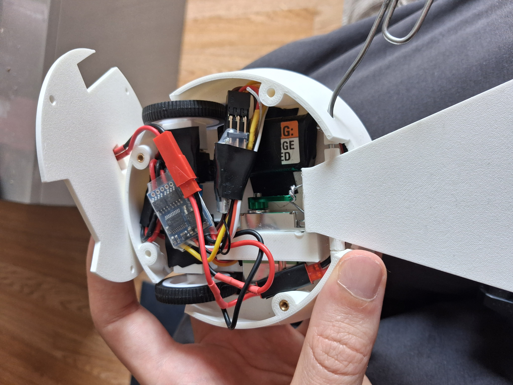
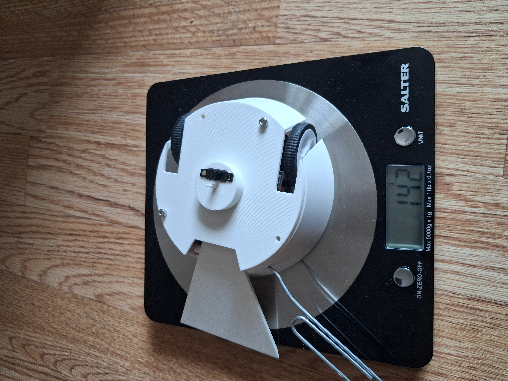

# the_abducter

This is a repo to hold the CAD for my robot, the abducter.

Notes charge the battery. 
Charging lights:
Version 2: Power = red light. Charging = green flashing light. Charged = green solid light.

Connect M2 to the right motor when the robot is facing away from you.

  
  
